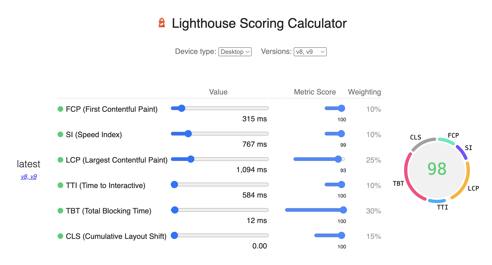
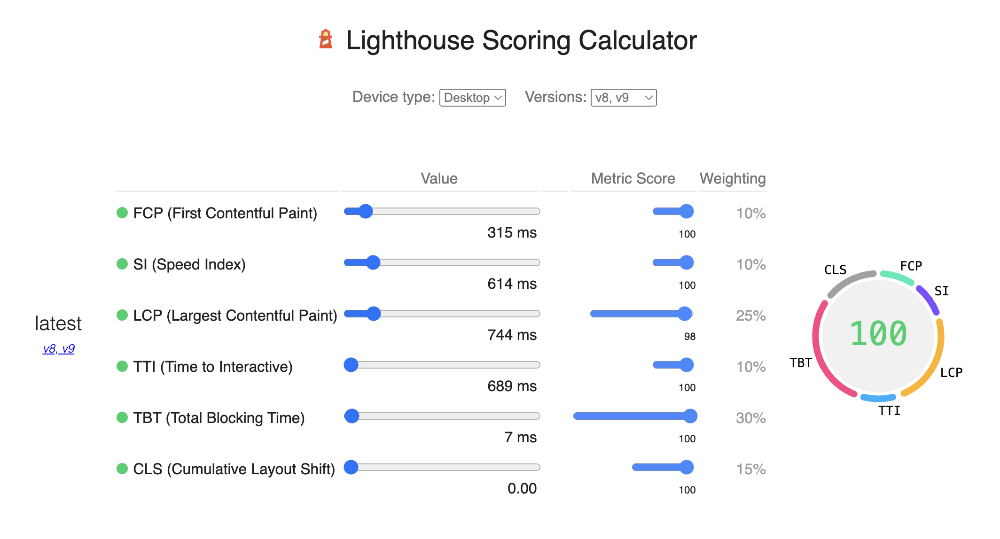

# Lab 8: The Ride-Hailing Service, Part 1

## Objectives
Create a ride-hailing service --both the client and server. Parts 1 and 2 are the client, and part 3 will be the server.

## Completion Status
- [x] The basics (e.g., folder name in private GitHub repository, file names, repo name, README.md file, one CSS file)
- [x] The README file
- [x] The map takes up the entire page
- [x] A separate file for the JavaScript (Not mix in with HTML page)
- [x] Map is centered on latitude = 42.352271, longitude = -71.05524200000001 (The location is South Station in Boston, MA)
- [x] 6 vehicle on the map are marker with the icon: `car.png`
- [x] Info window pop up with on click
- [x] A separate CSS file 
- [x] Performance Optimization

## Performance Optimization
<BEFORE>

<AFTER>

## Collaboration
Solo project

## Time in production
*Around 4 hours*